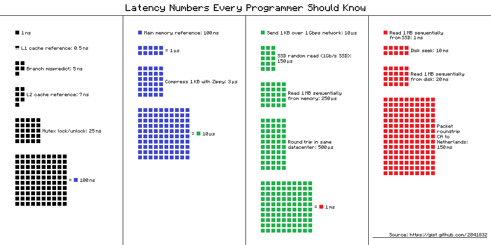

# Latency Numbers Every Programmer Should Know

This document is a plain-English walkthrough of a classic reference chart that visualizes **how long common computer operations take**, using a pixel/square metaphor where each small square represents a unit of time. The more squares shown, the longer the operation takes.

---

## The Core Idea: Orders of Magnitude

The most important thing to understand is that these latencies span an *enormous* range — from sub-nanosecond to millisecond — which is roughly a **billion-fold difference**. To make this intuitive, consider the following mental exercise: if 1 nanosecond were 1 second, then 1 millisecond would be about **11 days**.

The chart groups operations into four rough tiers, from fastest to slowest.

---

## Tier 1 — CPU & Cache Operations (nanoseconds)

These happen inside or very close to the CPU chip itself.

An **L1 cache reference** (0.5ns) and **L2 cache reference** (7ns) are reads from tiny, ultra-fast memory banks built right onto the processor. They are fast because the data is physically close to where the computation happens. A [**branch misprediction**](#branch-prediction-explained) (5ns) is the penalty the CPU pays when it guesses wrong about which code path to execute next — modern CPUs speculatively run ahead, and a wrong guess means throwing that work away. A **mutex lock/unlock** (25ns) is the cost of coordinating safely between threads.

At 100ns, you reach a **main memory reference** — reading from RAM. Notice how many more squares this takes compared to an L1 cache read. This gap (0.5ns vs 100ns) is exactly *why* CPU caches exist: RAM is fast in absolute terms, but **200× slower** than L1 cache. Every time you hear "cache locality matters," this number is the reason.

---

## Tier 2 — Memory & Compression (microseconds)

1 microsecond = 1,000 nanoseconds. **Compressing 1KB with Zippy** takes about 3µs — a reminder that even lightweight compression is not free. The landmark here is **10µs**, which represents a meaningful chunk of time for an in-memory operation and serves as a useful mental benchmark when thinking about the tiers that follow.

---

## Tier 3 — Network & SSD (microseconds to low milliseconds)

This is where things get particularly interesting for backend and distributed systems developers, because the jumps in cost become dramatic.

**Sending 1KB over a 1Gbps network** takes about 10µs — fast, but already 10,000× slower than an L1 cache read. An **SSD random read** takes 150µs. Reading 1MB sequentially from memory takes 250µs, and a **round trip within the same datacenter** takes 500µs. The key lesson here is that even "fast" network calls within a single datacenter are thousands of times slower than memory access. This gap is often invisible during development but becomes painfully real under production load.

---

## Tier 4 — Disk & Cross-Continent Network (milliseconds)

A **disk seek** on a spinning hard drive takes 10ms. **Reading 1MB from disk** takes 20ms. Most strikingly, a **packet round-trip from California to the Netherlands** takes about 150ms — that is the speed of light working against you across physical geography. No amount of software optimization can overcome the finite speed at which signals travel through fiber-optic cables.

---

## The Big Lesson

The chart is essentially a **hierarchy of pain**. Every time you cross a boundary — from cache to RAM, from RAM to SSD, from local to network — you pay an order-of-magnitude penalty. This is why great systems programmers obsessively think about *data locality* (keeping data in cache), why databases use in-memory buffers to avoid disk reads, and why microservice architectures that chain many network calls can become surprisingly slow even when each individual call seems fast.

A useful mental exercise to close with: if your application makes 10 sequential database calls, each with a datacenter round-trip of 500µs, that is already **5ms just in network time** — before any actual computation is done. Multiply that by hundreds of concurrent users, and the compounding effect becomes significant very quickly.

Understanding these numbers does not just make you a better systems programmer — it gives you an intuition for *where to look first* when something is slow.

---

 <a id="branch-prediction-explained"></a>
## Branch Misprediction

### The Problem: CPUs Don't Like Waiting

Modern CPUs are extremely fast, but they have a problem — they hate sitting idle. Reading the next instruction, decoding it, and executing it takes multiple steps, so CPUs use a technique called **pipelining**: they start working on the *next* instruction before the current one finishes.

This works great for straight-line code. But what about an `if` statement?

```java
if (user.isAdmin()) {
    // path A
} else {
    // path B
}
```

The CPU hits this and faces a dilemma: it doesn't know yet whether `isAdmin()` is true or false, but it needs to keep the pipeline busy *right now*. So it **makes a guess** — this is called **branch prediction**.

---

### What Happens Next

**If the guess is right** (prediction correct): the CPU already has the next instructions partially executed. You get the work essentially for free. ✅

**If the guess is wrong** (misprediction): the CPU has been speculatively executing the *wrong* path. All that work has to be thrown away, the pipeline flushed, and execution restarted on the correct path. This wasted work costs roughly **5–20 CPU cycles** — which is where that ~5ns penalty in the chart comes from. ❌

---

### How the Predictor Works

CPUs don't just guess randomly — they use sophisticated **branch predictor hardware** that learns from history. It essentially asks: *"The last several times I hit this branch, which way did it go?"*

This is why **predictable patterns are cheap and unpredictable ones are expensive**:

```java
// Predictable — almost always goes the same way, predictor learns quickly
if (index < array.length) { ... }

// Unpredictable — random data, predictor is wrong ~50% of the time
if (randomValue % 2 == 0) { ... }
```

---

### A Famous Real-World Example

There's a well-known Stack Overflow answer demonstrating this. Sorting an array *before* iterating over it with a conditional can make the loop dramatically faster — not because of anything the sort does logically, but because the sorted data creates a **predictable pattern** (all the falses, then all the trues) that the branch predictor can lock onto.

Unsorted data → random true/false → constant mispredictions → slow.  
Sorted data → predictable pattern → predictor always right → fast.

---

### Why It Matters for Java / JVM Code

In Java specifically, the **JIT compiler** is aware of branch prediction. It profiles which branches are "hot" (taken frequently) and can reorder or optimize code to make the common path the predicted one. This is part of why JIT-compiled Java can approach C speeds for tight loops — the JIT is essentially coaching the CPU's predictor.

The practical takeaway: in performance-critical inner loops, **data layout and access patterns matter** as much as algorithmic complexity.